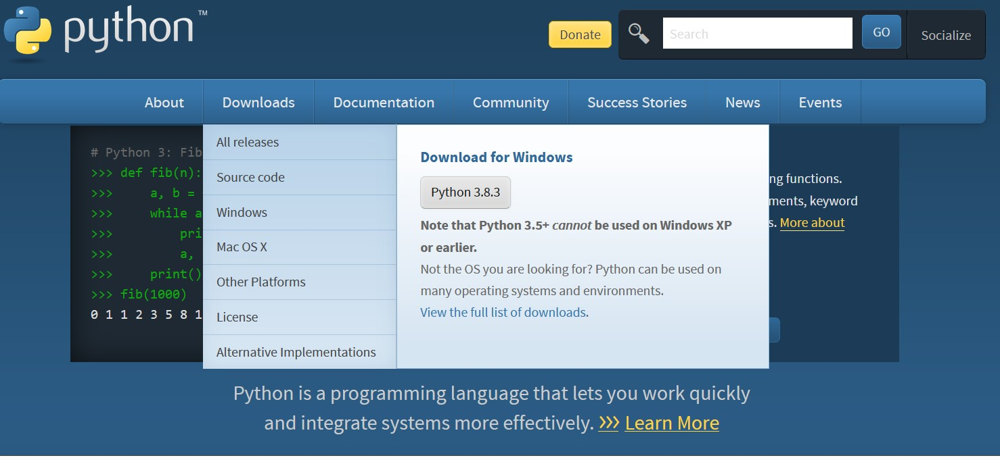
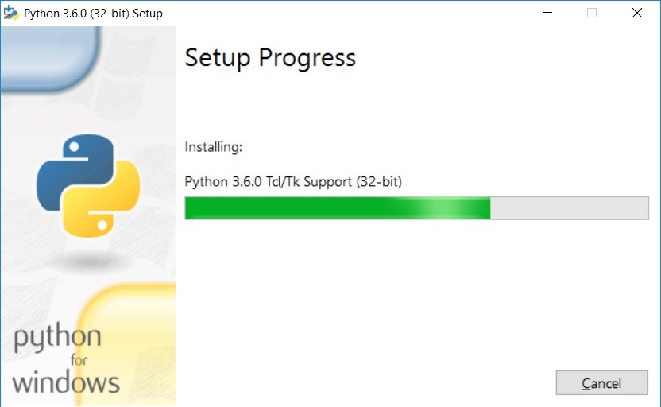

## Instalación

En este capítulo vamos a explicar cómo realizar la instalacion de Python en tu computador.

### Pagina oficial de Python

En esta parte se muestra **la pagina oficial** [Python](https://www.python.org/ "Pagina oficial de Python"),donde se realiza la descarga para instalar en cualquier Sistema Operativo y una vez realizado procedemos a la ejecucion.

- En esta imagen presentamos como se realiza la ejecucion del software Python para poder ternerlo instalado en mi maquina y poder correr mis scripts de **Python**
