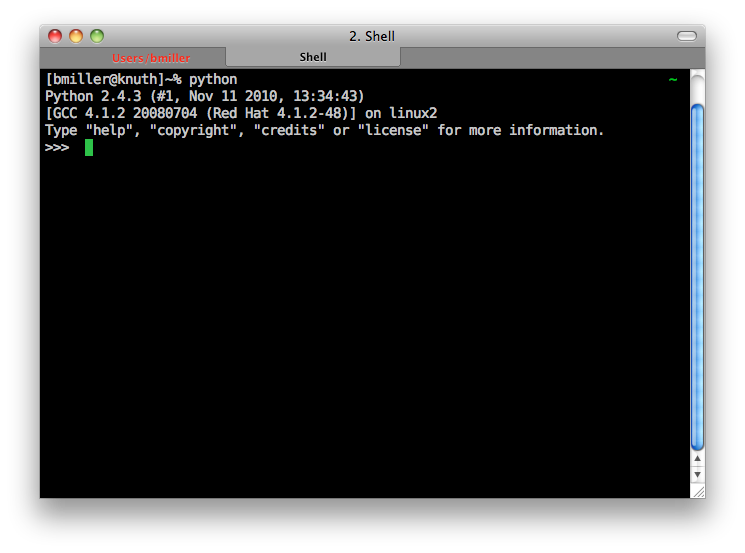
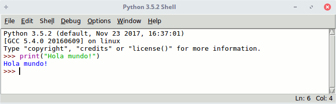
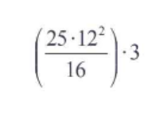

## Creacion del Fichero 

Ejecutamos la terminal de nuestra computadora para poder verificar si python se a instaldo con exito, introduciendo el siguiente codigo.

`python --version`

como se puede observar en la imagen se puede ver la shell la cual vamos a tipiar python y le damos enter y vamos a ver una imagen igual a la se muestra y ahi podemos ejecutar algunos script para empezar a trabajar con python3

en la presente imagen ejecutamos nuestro primer script en python que realizamos lo conocido como el `Hola Mundo` haciendo uso de la funcion `print()` que me permite mostrar el resultado de un script en python

### Crear un potente calculadora

Hasta ahora solo hemos visto ejemplo muy sencillos.Antes de adentrame en explicar detalladamente cómo funciona el lenguaje Python, comprobaremos que podemos visualizar el interprete como una potente calculadora en linea con la que obtener rapidamente valores de expresiones numericas.

#### Solución

>>> `((25 * 12**2)/16)*3`
**675.0**