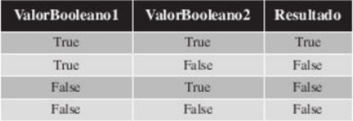
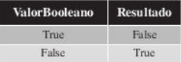
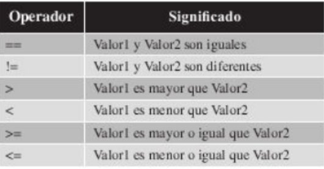

## Boleanos

En este capitulo vamos a explicarte el tipo de dato booleano, junto con los operadores logicos relacionales.

Los booleanos son tambien conocidos como los tipos de datos lógicos y se caracterizan porque unicamente pueden tener dos valores *True* o *False*

Vamos a un ejercicio como se asigna valores booleanos a variables y como se muestran por pantalla.

`verdadero = True`
`falso = False`
`print("Valor de la variable verdadero:", verdadero)`
`print("Valor de la variable falso:", falso)`

**Operadores Logicos**

Los operadores logicos son operadores que permites construir expresiones logicas y que tienen como resultado un valor booleano, es decir *True* o *False*. Los operadores logicos son operaciones que pueden utilizarse sobre variables de tipo booleano bien sean valores independientes o valores provenientes de otras oepraciones.

*Los operadores qeu puedes utilizar en el Lenguaje Python*

- **AND**
  -Operador logico que realiza la operacion logica Y entre los elementos. El resultado siempre sera *true* caso contrario uno de ellos sea *false* entonces dara como resutlado **FALSE**
- **OR**
  - Operador logico 'O' entre dos elementos.El resultado sera *true* si uno de los dos elementos es *true* en caso contrario sera *false*
- **NOT**
  - Operador logico que realiza la operacion 'NO', El resultado sera *true* si el elemento es *false*,y sera *false* si es *true*

**Resultado del Operador 'Y'**
\

**Resultado del Operador 'O'**
\

**Resultado del Operador 'NO'**
\

**Ejemplo**
`booleano1 = bool(input("Primer valor: "))`
`booleano2 = bool(input("Segundo valor: "))`
`booleano3 = bool(input("Tercer  valor: "))`
`print("comparamos los boleanos")`

**Operadores Relacionales**

Los operadores relacionales son operadores que permiten comparar dos valores entre y cuyo resultado es un valor booleano, *True* o *False*. Los operadores relacionales son operaciones de comparacion que pueden realizar sobre valores que sean valores independientes o valores provenientes de otras operaciones.

\
*Tabla de los operadores relacionales*

### Ejercicio
comparando con todos los valores 