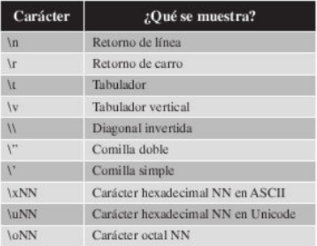

## Cadenas de Texto

En este capitulo a explicarte que son las cadenas de texto, como se utilizan y que operaciones puedes hacer con ellas. La manipulacion de las cadenas de texto en programacion es clave y jugara un papel fundamental dentro de todos los aplicativos que realices.

`cadena1 = "Hola python definido con comillas dobles"`\
`cadena2 = 'Hola Python definido con comillas simples'`\
`print(cadena1)`\
`print(cadena2)`

**Vamos con un ejemplo como acceder a caracteres de una cadena de texto**

`cadena = "Python"`
`print("Caracter posicion 0:", cadena[0])`
`print("Caracter posicion 1:", cadena[1])`
`print("Caracter posicion 2:", cadena[2])`
`print("Caracter posicion 3:", cadena[3])`
`print("Caracter posicion 4:", cadena[4])`
`print("Caracter posicion 5:", cadena[5])`

## Operadores con cadenas

Las cadenas de caracteres en Python pueden utilizar los operadores "+" y "*" para concatenar cadenas de texto y para multiplicar una cadena de texto.

La Operacion de concatenar nos va a permitir unir varias cadenas de texto en una unica cadena de texto resultante.La operacion  de multiplicar no va a dar como resultado una cadena de texto compuesta por n veces la cedena de texto que se multiplica.

`cadena1 = input("Introduzca la primera cadena:")`
`cadena2 = input("Introduzca la segunda cadena:")`\
`cadena3 = input("Introduzca la tercera cadena:")`\
`cadenasuma = cadena1 + ' ' + cadena2 + ' ' + cadena3`\
`cadenamultiplicar = (cadena2 + " ") * 5`\
`print("Caracter concatenado:", cadenasuma)`\
`print("Caracter multiplicado:", cadenamultiplicar)`

*Otro ejemplo mas corto*

`cadena1 = input("Introduzca la primera cadena:")`
`cadena2 = input("Introduzca la segunda cadena:")`\
`cadena3 = input("Introduzca la tercera cadena:")`\
`cadenasuma = cadena1`
`cadenasuma += ' '`
`cadenasuma = cadena2`
`cadenasuma += ' '`
`cadenasuma = cadena3`
`cadenasuma += ' '`
`print("Cadena concatenada:", cadenasuma)`

Ademas ofrece un operador que permite comprobar si una cadena contiene otra cadena o un caracter en concreto.El operador es **in**, y el formato de uso es el siguiente

**Cadena1 in Cadena2**

`cadena1 = input("Introduzca la primera cadena:")`
`cadena2 = input("Introduzca la segunda cadena:")`
`print("¿Esta la segunda cadena contenida en la primera?:",cadena2 in cadena1)`

## Caracteres Especiales

En este apartado te explicamos que existen un conjunto de caracteres que requieren una forma concreta a la hora de ser mostrados por pantalla, bien sea porque aportan funciones dentro de las cadenas de texto.

**Tabla de caracteres Especiales**
\

**Ejmplo**
`cadena1 = input("Introduzca la primera cadena:")`
`cadena2 = input("Introduzca la segunda cadena:")`\
`cadena3 = input("Introduzca la tercera cadena:")`\
`cadenaConSaltos = "\n\t" + cadena1 + "\n\t" + cadena2 + '\n\t' + cadena3`\
`print("Cadena con saltos:",cadenaConSaltos)`

En python existe una funcionalidad que permite ignorar los caracteres especiales dentro de una cadena e texto.Para ignorarlos basta con anadir el caracter **r** antes de la definicion de la cadena.

**Ejmplo**
`cadena1 = input("Introduzca la primera cadena:")`
`cadena2 = input("Introduzca la segunda cadena:")`\
`cadena3 = input("Introduzca la tercera cadena:")`\
`cadenaConSaltos = r"\n\t" + cadena1 + r"\n\t" + cadena2 + r'\n\t' + cadena3`\
`print("Cadena con saltos:",cadenaConSaltos)`

Esto se debe a que se ha anadido el caracter **r** antes de dichas cadenas con los caracteres especiales.

## **Funciones con cadenas**

El tipo de dato cadena de texto en Python posee una serie de funciones que nos permiten manipular las cadenas de texto realizado operaciones complejas de forma sencilla y con una simple instruccion.

***ValorDevuelto = CadenaTexto.NombreFuncion(Parametros)***

  - ValorDevuelto: La ejecucion de la funcion tendra un resultado.
  - CadenaTexto: cadena sobre la que se ejecutara la funcion
  - NombreFuncion: nombre de la funcion que se quiere ejecutar.
  - Parametros: no todas las funciones tienen parametros para ejecutarse, esta parte es independiente.

### **Metodos disponibles**

***capitalize**: Permite poner la primera letra de la cadena en mayuscula.
  - Valor devuelto: cadena de texto modificada.
  - Parametros: no tiene.

***capitalize**: Permite poner la primera letra de la cadena en mayuscula.
  - Valor devuelto: cadena de texto modificada.
  - Parametros: no tiene.

***title**: Permite poner la primera letra de cada palabra de la cadena de texto en mayuscula y el resto en minuscula.
  - Valor devuelto: cadena de texto modificada.
  - Parametros: no tiene.

***upper**: Permite poner en mayusculas por completo la cadena de texto.
  - Valor devuelto: cadena de texto modificada.
  - Parametros: no tiene.

***lower**: Permite poner en minisculas por completo la cadena de texto.
  - Valor devuelto: cadena de texto modificada.
  - Parametros: no tiene.

***len**: Permite saaber el numero de caracteres de la cadena de texto.
  - Valor devuelto: entero que indica el numero de caracteres que con tiene la cadena de texto.
  - Parametros: no tiene.

***count**: Permite saber el numero de veces que aparecen una cadena de texto dentro de otra.
  - Valor devuelto: entero que indica el numero de aparecidos.
  - Parametros: no tiene.

***isalmun**: Permite comprobar si todos los caracteres que componen la cadena de texto son alfanumericos o no.
  - Valor devuelto: booleano no son caracteres alfanumericos.
  - Parametros: no tiene.

***isalpha**: Permite comprobar si todos los caracteres de la cadena de texto son caracteres alfabeticos.
  - Valor devuelto: booleano que indica si son todos los caracteres.
  - Parametros: no tiene.

***isdigit**: Permite comprobar si todos los caracteres de la cadena de texto son caracteres que representan digitos.
  - Valor devuelto: booleano que indica si son todos los caracteres numericos o no.
  - Parametros: no tiene.

***isnumeric**: Permite comprobar si todos los caracteres de la cadena de texto son caracteres con representacion numerica.
  - Valor devuelto: booleano que indica si son todas los caracteres numericos.
  - Parametros: no tiene.

***isdecimal**: Permite comprobar si todos los caracteres de la cadena de texto son caracteresc con representacion decimal.
  - Valor devuelto: booleano que indica si son todos los caracteres decimales.
  - Parametros: no tiene.

***islower**: Permite comprobar si todos los caracteres que componen la cadena esta minuscula.
  - Valor devuelto: booleano que indica si todos los caracteres estan en minuscula.
  - Parametros: no tiene.

***isupper**: Permite comprobar si todos los caracteres que componen la cadena de texto en mayuscula.
  - Valor devuelto: booleano que indica si todos los caracteres estan en mayusucula.
  - Parametros: no tiene.

***istitle**: Permite comprobar si el primer caracter de todas las palabras es mayuscula y el resto minuscula.
  - Valor devuelto: retorno un valor booleano
  - Parametros: no tiene.

***isspace**: Permite comprobar si la cadena de texto esta compuesta exclusivamente por caracteres en blanco.
  - Valor devuelto: devulve un booleano si la cedena cumple
  - Parametros: no tiene.

***lstrip**: Permite eliminar los caracteres en blanco al comienzo de la cadena.
  - Valor devuelto: cadena de texto modificada.
  - Parametros: no tiene.

***rstrip**: Permite eliminar espacios en blanco al final de la cadena.
  - Valor devuelto: cadena de texto modificada.
  - Parametros: no tiene.

***strip**: Permite eliminar espacios al incio de la cadena.
  - Valor devuelto: cadena de texto modificada.
  - Parametros: no tiene.

***max**: Permite conocer el caracter mayor alfabeticamente.
  - Valor devuelto: caracter alfanumerico con mayor valor de la cadena.
  - Parametros: no tiene.

***min**: Permite conocer el caracter menor alfabeticamente.
  - Valor devuelto: caracter alfanumerico con menor valor de la cadena.
  - Parametros: no tiene.

***startswith**: Permite comprobar si una cadena de texto empieza por una cadena de texto concreta.
  - Valor devuelto: booleano que indica si empieza o no por esa cadena.
  - Parametros: tiene un parametro obligatorio que es la cadena que se tiene que comprobar.

***endswith**: Permite comprobar si una cadena de texto termina por una cadenas de texto concreta.
  - Valor devuelto: booleano que indica si termina o no por cadena.
  - Parametros: tiene un parametro obligatorio que es la cadena que se tiene qeu comprobar

***swapcase**: Permite invertir las mayusculas y minusculas de la cadena de texto, es decir las mayusuculas pasan a minusculas.
  - Valor devuelto: cadena de texto modificada.
  - Parametros: no tiene.

***split**: Permite convertir una cadena de texto en una lista de elementos que se encuentren separados.
  - Valor devuelto: lista de elementos.
  - Parametros: tiene un parametro opcional.

***find**: Permite encontrar una cadena de texto dentro de otra buscando de izquierda a derecha.
  - Valor devuelto: en caso de encontrar la cadena devolvera la posicion dentro de la cadena.
  - Parametros: cadena a buscar.

***center**: Permite centrar el texto de la cadena en una cadena de texto de longitud anadiendo espacios en blanco a la izquierda y derecha del mismo.
  - Valor devuelto: cadena de texto modificada.
  - Parametros: parametro obligatorio

***zfill**: Permite crear una cadena de texto de longitud indicada por parametros compuesta por ceros a ala izquierda.
  - Valor devuelto: cadena de texto modificada.
  - Parametros: no tiene.