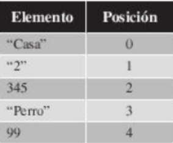

## **Tuplas** 🚛 

En este apartado vamos a hablar sobre los tipos de datos tuplas, que son un conjunto ordenado e inmutable de elementos.

Pueden contener elementos de diferentes tipos, por ejemplo una tupla puede estar compuesta por cadenas de texto, por numeros enteros, etc.

Las tuplas en Python se representan por una serie de elementos separados por comas y delimitadas entre parentesis.Veamos un ejemplo de tupla:

```("Casa","2",345,"Perro",99)```

Al igual que en las listas, los elementos de las tuplas ocupan posiciones concretas y mediante esa posicion que ocupan podemos acceder directamente a los elementos.

\


### **Ejercicio1**

```
tupla = ('Casa','2',345,'Perro',99)
print("Elementos de la tupla: ", tupla)
print("Elementos de la posicion 0: ",tupla[0])
print("Elementos de la posicion 1: ",tupla[1])
print("Elementos de la posicion 2: ",tupla[2])
print("Elementos de la posicion 3: ",tupla[3])
print("Elementos de la posicion 4: ",tupla[4])
```

## **Funciones con tuplas**

Al igual que las listas, las tuplas tienen funciones asociadas al tipo de dato, pero el numero de funciones disponibles es menor que las listas.

- count => cuenta el numero de veces que aparecen el elemento indicado como parametro dentro de la tupla.

- index => devuelve la posicion de la primera ocurrencia de izquierda a derecha en la tupla del elemento. 

- len => devulve un numero entero que indica el numero de elementos que la componen.

### **Ejercicio1**

```
tupla = ('Casa','2',345,'Perro',99)
print("Elementos de la tupla: ", tupla)
print("Numero de elementos 99: ", tupla.count(99))
print("Posicion que ocupa el elemento Perro: ", tupla.index("Perro"))
print("Numero de elementos de la tupla: ", len(tupla))
```
## **Extrasion de tuplas**

La instruccion extraera una nueva tupla que empezara en el indice n y terminara en la m-1.Tienes que tener en cuenta lo siguiente.

``` Tupla[n:m]```

- n siempre tiene que ser menor que m.
- Si no se especifica el valor para m se supone que el el tamano de la tupla menos uno.

### **Ejercicio1**

```
tupla = (1,2,3,4,5,6,7,8,9)
print(tupla)
print(tupla[4:9]) 
print(tupla[:3]) 
print(tupla[2:]) 
```
## **Concatenar una tupla**

La siguientes funcionalidad de las tuplas que vamos a explicar es el uso del operador "+" para realizar uniones de tuplas.

``` TuplaConcatenada = Tupla1 + Tupla2```

tupla1 = (29,"Television",8763)
tupla2 = (1,2,3,"Videojuego")
tuplaConcatenada = tupla1 + tupla2
print("tuplaConcatenada: ", tuplaConcatenada)

La tupla resultante de la multiplicacion sera una tupla compuesta por tantas veces la Tupla como valor tenga el numero entero.

```TuplaResultante = Tupla * NumeroEntero```

```
tupla = (1,2,3,4,5,6,7,8,9,0)
print(tupla)
tuplaResultante = tupla * 4
print(tuplaResultante) 
```
