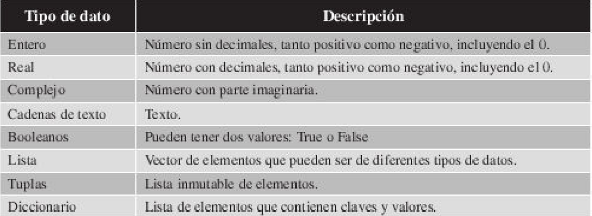

## Tipos de Datos

En informática, la información no es otra cosa que una secuencia de ceros y unos que se estructuran en bloques para facilitar el manejo de ésta.

Por lo tanto, toda la información que existe se encuentra tipificada por el tipo de información que es (tipo de dato).

\

Tal y como hemos comentado desde el principio, las variables no tienen un tipo correcto en Python, puedes utilizar una variable para almacenar un número en una parte de tu programa