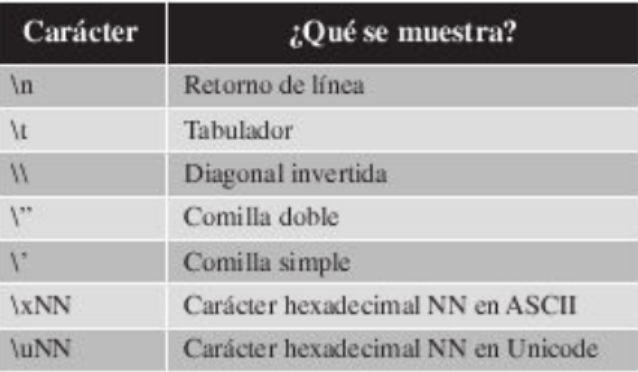

## Ejemplos con los Tipos de datos 🎨 

### **Cadena**

Una cadena (string) es un conjunto ordenado de caracteres que se utilizan para representar información textual.En Python, al igual que sucede en CSharp, las cadenas son objetos **inmutables** y cualquier operación sobre una cadena siempre devuelve un resultado de la operación requerida.

`a = 'Cadena con comillas simples'`\
`b = "Cadena con comillas dobles"`

Es posible utilizar un tipo de comilla externa (rodeada el texto) y otro tipo de forma interna, como parte del texto, tal y como se observa en el siguiente ejemplo:

`b = "I'm the author.\n\"`\
`print(b)`

\

Existen un conjunto de caracteres que requieren una forma concreta a la hora de ser mostrados por pantalla, bien sea porque aportan funciones dentro de las cadenas de texto.

### Ejemplos
`texto = "Hola Mundo"`\
`print(texto)`

`
print("Day 1 - Python print Function")
print("The function is declared like this")
print("print('what to print')")
`

`print("Hello world!\nHello world!")`

## **Concatenar**

`print("Hola" + " " + "Jose")`

## **Inputs**
Python dispone del comando **input** para leer informacion introducida por los usuarios de la aplicacion mediante el teclado.

Vamos a ver como funciona con un ejercicio en el que vamos a solicitar al usuario de la aplicación su nombre y sus apeliidos mediante los comandos *print* e *input*

`print("Introduce su nombre:")`\
`nombre = input()`\
`print("Introduce sus apellidos:")`\
`apellidos = input()`\
`print("Hola", nombre, apellidos)`

`nombre = input("Introduce su nombre:")`
`apellido = input("Introduce sus apellidos:")`
`print("Hola", nombre, apellido)`

`print( len( input("What is your name? ") ) )`

`
print("Bienvendio al generador de nombres.")
calle = input("¿Cual es el nombre de tu ciudad:?\n")
mascota = input("¿Cual es el nombre de tu mascota:?\n")
print("Nuestro nombre puede ser:" + calle + " " + mascota)
`

## **Comentarios**

Creacion de comentarios en python es bastante importante para compreder el desarrollo de nuestraas aplicaciones 

`#Impresion de hola mundo
print("Hola Mundo")
`