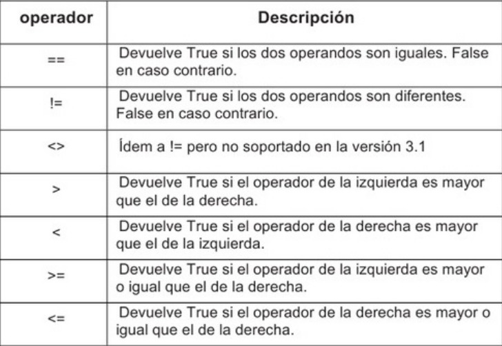
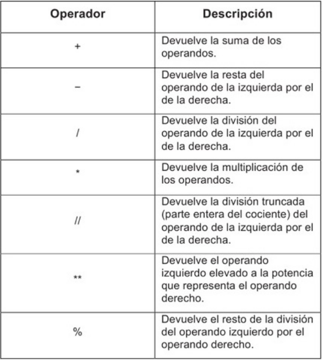
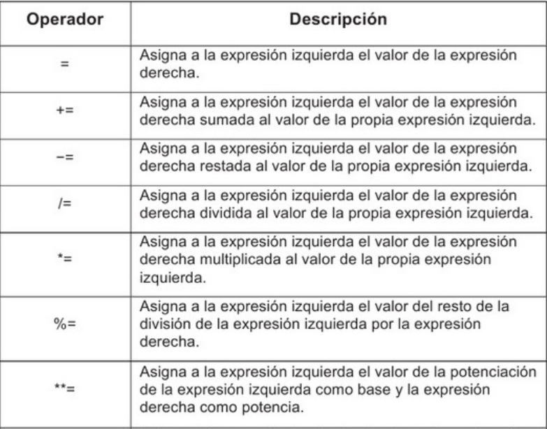
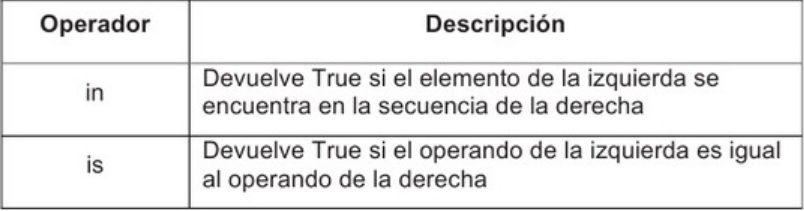

## Numéricos 🔞 

Python cuenta con  tres objetos numericos de manera predefinida, estos son: los objetos que presentan números enteros, los que representan números complejos y aquellos que manejan números de punto flotante.

Los tipos de datos en Python relacionados con los numeros son tres:
  - **Enteros**
    - numero entero con limite de valor.
  - **Reales**
    - numero compuesto por parte entera y parte decimal
  - **Complejo**
    - numero compuesto por parte real y parte imaginaria

### Comprobacion de tipo de dato 💢 
para poder verificar el tipo de datos se utiliza
```
numero = 5
type(numero) 
```

### Operadores Arimeticos 🕣

Los operadores arimeticos son aquellos operadores que nos van a permitir realizar operaciones arimeticas con los datos. Python dispone de los siguientes operadores arimeticos:

- **Suma**  
  - el operador "+" realizar la suma de dos valores de tipo numerico.
- **Resta**  
  - el operador "-" realizar la resta de dos valores de tipo numerico.
- **Multiplicacion**  
  - el operador "*" realizar la multiplicacion de dos valores numericos.
- **Division**  
  - el operador "/" realizar la division de dos valores numericos.
- **Division entera**  
  - el operador "//" realizar la division entera de dos valores numericos.
- **Modulo**  
  - el operador "%" realizar el modulo de dos valores numericos, es decir, obtiene el resto de la division.
- **Exponente**  
  - el operador "**" realizar el exponente de dos valores numericos.
- **Negacion**  
  - el operador "-" asigna un valor negativo a un valor numerico.

Los operadores arimeticos tienen un orden de precedencia a la hora de ejecutar las operaciones, es el siguiente
- 1. Se ejecuta la operacion de exponente.
- 2. Se ejecuta la operacion de negacion.
- 3. Se ejecuta la operacion de multiplicacion, division, division entera y modulo
- 4.Se ejecuta las sumas y restas.

Te recomendamos que a la hora de utilizar operadores arimeticos utilices parantesis para establecer el orden concreto de resolucion de las operaciones, asi no tendras que preocuparte por el orden de presedencia.

## Numeros Enteros 📶 

Los numeros enteros son aquellos numeros que no tienen decimales y que pueden ser positivos y negativos, incluyendo al cero.Los numeros enteros se representan en Python como *int*.

**Transformar un string a un entero**
```
numero1 = int(input("Primer numero: "))
numero2 = int(input("Segundo numero: "))
print("Resultado: ", numero1 + numero2)
```

**Creacion de un ejemplo:**
```
base = int(input("Base: "))
exponente = int(input("Exponente: "))
print("Resultado: ", base ** exponente)
```
## Numeros Reales 📶

Los numeros reales son aquellos numeros que tienen decimales.En Python se representan como *float* y la separacion entre la parte entera y la parte decimal se realiza con un punto.

**Creacion de una resta**
```
minuendo = float(input("Minuendo: "))
sustraendo = float(input("Sustraendo: "))
print("Resultados: ", minuendo - sustraendo)
```

**Creacion de una division**
```
dividendo = float(input("Dividendo: "))
divisor = float(input("Divisor: "))
print("Resultados: ", dividendo / divisor)
```

**Creacion de una multiplicacion**
```
multiplicando = float(input("Multiplicando: "))
multiplicador = float(input("Multiplicador: "))
print("Resultados: ", multiplicando * multiplicador)
```

## Redondeo de numeros reales

Los numeros reales tienen un numero infinito de decimales, pero Python dispone de una instruccion que permite acortar el numero de decimales, se trata de la instruccion round.

- Las instruccione *round* utilizada dos parametros para ejecutar

  - Numero real a redondear
  - Numero de decimales a los que se quieren redondear el numero.

**Creacion de una multiplicacion redondeando**
```
multiplicando = float(input("Multiplicando: "))
multiplicador = float(input("Multiplicador: "))
resultado = round(multiplicando * multiplicador,1)
print("Resultado de la multiplicacion: ", resultado)
```

## Numeros complejos

Los numeros complejos son aquellos numeros que estan compuestos por una parte real y una parte imaginaria, y en el que cada una de las partes es un numero decimal.

Mediante complex lo que hacemos es transformar las dos cadenas de texto leidas en un numero complejo.Tal como puedes observar, ambas cadenas leidas son transformadas en numeros reales, ya que tanto la parte imaginario.

```
numero = complex(float(input("Parte real: ")),float(input("Parte imaginaria: ")))
print(numero)
```

**Segundo ejercicio**
```
sumando1 = complex(float(input("parte real sumando1: ")) float(input("Parte imaginaria sumando 1:")))
sumando2 = complex(float(input("parte real sumando2: ")) float(input("Parte imaginaria sumando 2:")))
print("Resultado:",sumando1 + sumando2)
```

## Uso de Paréntesis

Tal y como hemos explicado al comienzo del capitulo, en python el orden de ejecucion de las operaciones dependen de la propia operacion qeu se ejecuta.Para evitar problemas con el orden o confusiones te aconsejamos que utilices parentesis para establecer el orden de la ejecucion

**ejemplo**
  *(8+(7x(5^2)))-(5//3)*
- 1 Primera operacion 5^2
  - Operacion pendiente *(8+(7x25))-(5//3)*
- 2 Operacion *7x25*
  - Operacion pendiente *(8+175))-(5//3)*
- 3 Operacion *8+175*
  - Operacion pendiente *183-(5//3)*
- 4 operacion *5//3*
  - Operacion pendiente 183-1
- 5 Operacion final *183-1*
  - Resultado final *182*


## Operadores de Comparacion

Los operadores de comparacion son binarios y cada uno de sus argumentos pueden ser una expresion que evalue a un valor de un tipo diferente (*numericos, cadenas, listas*)

**Tabla Operadores de Comparacion**
\

**Ejemplo**
```
a = 2 != 2
b = [] == 1
c = 2 > 1
d = 3 >= 3

print(a)
print(b)
print(c)
print(d)
```

**Ojo 👁️‍🗨️**

Los operadores de comparacion suelen utilizarse en sentencias condicionales para controlar el flujo de un programa de acuerdo a determinar la condicion.

## Operadores Arimeticos

Los operadores arimeticos al igual que los de comparacion cuentan con un operando derecho y uno izquierdo, son binarios.Generalmente se aplican a datos numericos aunque el operador de suma (+) tambien se emplea para concatenar secuencias *(cadenas, listas, etc)*.segun se muestre en el sigueinte ejemplo:

**Ejemplo**

```
print("Jazz  de " + " New York ")
print([] + [1])
```

Entre las operaciones que incluyen se encuentran la resta, la multiplicacion, la division, la potencia y el resto, como se puede mostrar en la imagen.

**Tabla Operadores Arimeticos**
\

**Ejemplo**
```
print((2+3)**2)
print((4%3)-1)
print(2*9/3)
```
Todos los operadores excepto el operador de potencia son asociativos de izquierda a derecha. La potenciacion es asociativa de derecha a izquierda.

## Operadores de asignacion

La asignacion es una de las operaciones basicas en los lenguajes imperativos y forma parte indisoluble del modelo Von Neumann que utilizan los ordenadores en la actualidad.

**Tabla Operadores de Asignacion**
\

En la proxima seccion se detallaran algunos operadores que no se clasifican dentro de las categorias anteriores pero definitivamente resultan utiles en multiples situaciones.


## Otros Operadores

Entre los operadores que escapan a las clasificaciones previas se encuentran los llamados operadores de identidad y los operadores de membresia.

**Tabla Operadores de Asignacion**
\

```
l = [1,2,3]

print(2 in 1)
print(2 is "")
print(2 is 2)
```