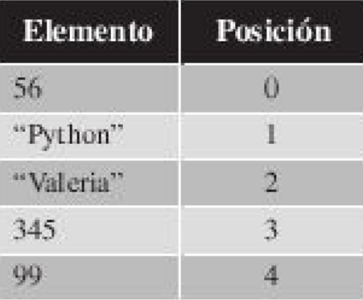

## **Listas** ⤵ 

En este apartado vamos a hablar sobre los tipos de datos listas, que son un conjunto ordenado de elementos que pueden contener datos de cualquier tipo.

Una caracteristica muy importante de las listas es que pueden contener elementos de diferentes tipos, por ejemplo una lista puede estar compuesta por cadenas de texto, por numeros enteros y por su puesto, por otras listas.

De todos los tipos de datos que vamos a ver en este capitulo, las listas son los mas flexibles de todos.

**Como reconocer una lista: ** las listas se presentan por una serie de elementos separados por comas y delimitadores por corchetes.

```[56,"Python","Valeria",345,99]```

**Tabla posiciones concretas**
\

### **Ejercicio1**
```
lista = ["Python","RA-MA",2019,"Libro",3]
print(lista)
print(lista[0])
print(lista[1])
print(lista[2])
print(lista[3])
print(lista[4])
```

## **Concatenar una lista**

Consiste utilizar el operador "+" para realizar uniones de listas.El operador se utiliza de las siguientes manera:

```
ListaConcatenada = lista1 + lista2
```

Ademas podemos observar una funcion para conocer el numero de elementos que componen la lista es conocida como . ``` len() ```

### **Ejercicio2**

```
lista1 = ["Camiseta","Pantalon","Zapatilla"]
lista2 = ["Abrigo","Jersy","Sudadera","Calcetines"]
print("Numero elementos de lista1: ", len(lista1))
print("Lista1: ", lista1)
print("Numero elementos de lista2: ", len(lista2))
print("Lista2: ", lista2)
listaConcatenada = lista1 + lista2
print("Numero elementos de listaconcatenada:", len(listaConcatenada))
print("listaConcatenada: ", listaConcatenada)
```
### **Ejercicio3**

En este tercer ejercicio es del estilo del ejercicio anterior, pero vamos a ir anandiendo elementos a la lista de diferentes formas.

El anadir lista es una operacion recurrente dentro de la programacion, es por ello que vamos a poner especial interes en esta operacion.

```
lista = ["Camiseta","Pantalon","Zapatillas"]
print(lista)
lista = lista + ["Abrigo"]
print(lista)
lista = lista + ["Jersey","Sudadera"]
print(lista)
lista = lista + ["Calcetines"] + ["Bufanda"]
print(lista)
```

### **Modificacion de elementos con listas**

``` Lista[posicion] = NuevoValor```

La posicion indica el elemento que sera modificado dentro de la lista, el valor asignado es el nuevo valor que tendra dicho elemento.

```
lista = ["Camiseta","Pantalon","Zapatillas"]
print(lista)
lista[1] = "Cazador"
print(lista)
```

### **Eliminar elementos con listas**

``` del Lista[posicion]```

```
lista = ["Camiseta","Pantalon","Zapatillas"]
print(lista)
del lista[0]
print(lista)
```
### **Agregar el operador "*"**

Este operador nos permite concatenar una lista con ella misma un numero finito de veces. El operador se utiliza de la siguiente forma

``` ListaResultante = lista * NumeroEntero```

lista = ["Camiseta","Pantalon","Zapatillas"]
print(lista)
listaResultante = lista * 3
print(listaResultante)

### **Accerder a los elemetos de la lista**
```
lista = ["Camiseta", ["Calcetines","Cazador"],"Zapatillas"]
print(lista)
print(lista[0])
print(lista[1])
print(lista[2])
print(lista[1][0])
print(lista[1][1])
```
## **Extracion de porcion de una lista** 🧺 

``` Lista[n:m]```

La instruccion extraera una nueva lista que empezara en el indice n y terminara en el m-1.Tienes que tener en cuenta lo siguiente:

- n siempre tiene que ser menor que m.
- Si no se especifica el valor para n se supone que es 0.
- Si no se especifica el valor para m se supone que es el tamano de la lista menos uno.

### **Ejercicio1**
```
lista = [1,2,3,4,5,6,7,8,9]
print(lista)
lista1 = lista[3:7]
print(lista1)
lista2 = lista[:5]
print(lista2)
lista3 = lista[6:]
print(lista3)
```
## **Metodos Propios** ✅ 

El tipo de dato lista Python posee una serie de funciones que nos permiten manipular las listas realizando operaciones complejas de forma sencilla y con una simple instruccion.

``` lista.NombreFuncion(Parametro)```

Veamos en detalle cada una de las partes:
  - Lista: lista que ejecutan la funcion.
  - NombreFuncion: nombre de la funcion que se quiere ejecutar.
  - Parametros: no todas las funciones tienen parametros para ejecutarse, esta parte es dependiente de la funcion que se quiere ejecutar.

Las funciones de listas que pone a nuestras disposicion Python son las siguientes:

- **append**
  - anade el elemento pasado como parametro a la lista. 
- **insert** 
  - anada el elemento pasado como parametro a la lista en la posicion indicada tambien por parametro.
- **remove** 
  - elimina la primera ocurrencia empezando por la izquierda de la lista del elemento indicado como parametro.
- **reverse**
  - invierte el orden de la lista
- **sort**
  - ordena la lista si es posible.
- **pop**
  - elimina un elemento de la lista y lo devuelve como resultado de la operacion.
- **extend**
  -Anade los elementos de una lista a la lista.
- **count**
  - Cuenta el numero de veces que aparece el elemento indicado como parametro de la lista.
- **index**
  - Devuelve la posicion de la primera ocurrencia de izquierda a derecha en la lista del elemento pasado como parametro.
-**clear**
  - elimina todos los elementos de la lista.

A continuacion vamos a realizar un ejercicio para aprender a utilizar todas las funciones que acabamos de explicar.

### **Ejercicio1**

```
lista = [45,32,3,78]
print("Lista original: ", lista)
lista.append(992)
lista.append(4)
print("Lista despues de usar append: ", lista)
lista.sort()
print("Lista ordenada: ", lista)
lista.reverse()
print("Lista al reves: ", lista)
listaextend = [1,5,87,45]
lista.extend(listaextend)
print("Lista despues de extend: ", lista)
lista.sort(reverse=True)
print("Lista ordenada al reves: ", lista)
print("Numero de elementos 45: ", lista.count(45))
lista.insert(4,111)
print("Lista despues de insert: ", lista)
lista.remove(45)
print("Lista despues de remove: ", lista)
print("Posicion del elemento 111: ", lista.index(111))
lista.pop()
print("Lista despues de pop: ", lista)
lista.clear()
print("Lista despues de clear: ", lista)
```
## **Operadores IN/NOT en listas** 🏧 

En muchos momentos nos sera de gran utilidad saber si un determinado elemento esta o no en una lista.Para ello haremos uso de los operadores in/not in , que tiene el sigueinte formato

``` elemento_a_buscar[in/not in]lista_en_la_que_buscar```

Estos operadores nos devolveran un valor booleano indicando si el elemento esta o no en la lista

``` 
7 in  lista_3
```

## **Compresion de listas** 🥑 

Mediante la compresion de listas se proporciona un metodo rapido para crear una lista de elementos.Tiene el siguiente formato

``` [expresion bloque_for [bloques_for y bloques_if]]```

Distinguimos entre los corchetes exteriores (obligatorios en el formato) y los interiores, que como siempre nos indican que lo que aparece en su interior es opcional y puede, o no aparecer.Recorre los elementos que nos marcan los bucles *for* (que pueden estar anidados), se comprueba las condiciones impuestas por los bloques if

### **Ejercicio1**

```
lista_5 = [4,6,8,10]
lista_9 = [x**2 for x in lista_5 if x > 7]
print(lista_9) 

lista_2 = [1,2,3]
lista_5 = [4,6,8,10]
lista_10 = [x+y for x in lista_2 for y in lista_5]
print(lista_10)

lista_11 = [x + y for x in lista_2 if x > 1 for y in lista_5 if y > 7]
print(lista_11)

lista_12 = [2*x for x in range(100,140,4)]
print(lista_12)
```
