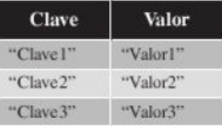

## **Diccionarios** 🥯 

En este apartado vamos a hablar sobre los tipos de datos diccionarios, que son un conjunto ordenado de elementos cuyos indices no son numericos sino identificadores.

Pueden contener datos de cualquier tipo de dato, los diccionarios son colecciones de elementos compuestos por una clave y un valor asociado.

Los diccionarios en Python se delimitan por llaves "{}", con los elementos separados por comas y la clave separada del valor mediante dos puntos.

``` 
{"clave1":"valor1","clave2":"valor2","clave3":"valor3"}
```

\

Las claves de los diccionarios pueden ser de diferentes tipos de datos, aunque siempre deberan de ser datos inmutables.

## **Manipulacion**

```
diasSemana = {"Lunes": "Monday",
              "Martes":"Tuesday",
              "Miercoles":"Wednesday",
              "Jueves":"Thursday",
              "Viernes":"Friday"}

print(diasSemana["Lunes"]) 
print(diasSemana["Miercoles"]) 
print(diasSemana["Viernes"]) 
```
- La forma de anadadir una elemento al diccionario es:
  - ``` diccionario[NuevaClave] = NuevoValor```
- La forma de modificar el valor de un elemento del diccionario:
  - ``` diccionario[claveQueSeVaModificar] = NuevoValor```
- La forma de eliminar un elemento del diccionario:
  - ``` del diccionario[claveElementoBorrar]```

### **Ejercicio1**

```
diasSemana = {"Lunes": "Monday",
              "Martes":"Tuesday",
              "Miercoles":"Wednesday",
              "Jueves":"Thursday",
              "Viernes":"Friday"}

print(diasSemana)
diasSemana["Sabado"] = "Saturday"
print(diasSemana)
diasSemana["Domingo"] = "Sunday"
print(diasSemana)
diasSemana["Lunes"] = ""MondayBorrar"
print(diasSemana)
del diasSemana["Lunes"]
print(diasSemana)
```
## **Funciones**

Es posible utilizar las funciones *len*, *max*, *min* con los diccionarios.La primera devolvera el numero de elementos que contiene el diccionario; la segunda, el elemento con el valor mayor y la tercera, el elemento con el valor menor.

``` 
diasSemana = {"Lunes": "Monday",
              "Martes":"Tuesday",
              "Miercoles":"Wednesday",
              "Jueves":"Thursday",
              "Viernes":"Friday"}

print("Numero de elementos del diccionario: ", len(diasSemana))
print("Elemento mayor del diccionario: ", max(diasSemana))
print("Elemento menor del diccionario: ", min(diasSemana))
```
## **Metodos**

El tipo de dato diccionario en Python posee una serie de funciones que nos permiten manipular los diccionarios realizados operaciones complejas de forma sencilla y con una simple instruccion.

```Diccionario.NombreFuncion(Parametros)```

- copy => Realiza una copia exacta del diccionario en uno nuevo.
  
- pop => Obtiene el valor de la clave pasada como parametro y ademas elimina el elemento del diccionario.

- popitem => obtiene un elemento aleatorio y en caso de que no tenga elementos el diccionario da un error.
  
- get => obtiene el valor de la clave pasada como parametro.
  
- update => realiza una actualizacion del diccionario utilizando otro diccionario.

- setdefault => intenta insertar un elemento (clave y valor) en el diccionario.
  
- clear => elimina todos los elementos del diccionario.
  
- items => devuelve un objeto iterable (que puede utilizarse en bucles.Lo veremos en proximo capitulo)
  
- keys => devulve un objeto iterable (que puede utilizarse en bucles)
  
- values => devuelve un objeto iterable(que puede utilizarse en bucles)


## **Ejercicios** ⚛ 
``` 
diasSemana = {"Lunes": "Monday",
              "Martes":"Tuesday",
              "Miercoles":"Wednesday",
              "Jueves":"Thursday",
              "Viernes":"Friday"}

print("Diccionario original: ", diasSemana)
diccionarioCopia = diasSemana.copy()
print("Diccionario copy: ", diccionarioCopia)
print("Valor del lunes pop(): ", diasSemana.pop("Lunes"))
print("Diccionario despues del pop: ", diaSemana)
print("Elementos al azar con popitem: ",diasSemana.popitem())
print("Diccionario despues del popitem: ", diasSemana)
print("Valor del Martes (get):", diasSemana.get("Martes"))
print("Valor del Lunes (get):", diasSemana.get("Martes"))
print("Valor del Lunes (get):", diasSemana.get("Martes"))
print("Valor del Lunes (get) (no existe): ", diasSemana.get("Lunes"))
print("Valor del Lunes (get) (no existe): ", diasSemana.get("Lunes","No existe"))
diasSemana.update({"Lunes":"MondayNuevo"})
print("Diccionario despues del update: ", diasSemana)
print("setDefaul del Sabado: ", diasSemana.setdefault("Sabado","Saturday"))
print("Diccionario despues del setDefault (nuevo elemento):, diasSemana")
print("Elemento iterable (items): ", diasSemana.items())
print("Elemento iterable (claves): ", diasSemana.keys())
print("Elemento iterable (valores): ", diasSemana.values())
print("Diccionario despues del clear: ", diasSemana.clear())
```