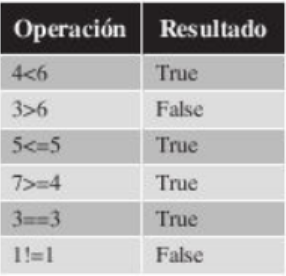
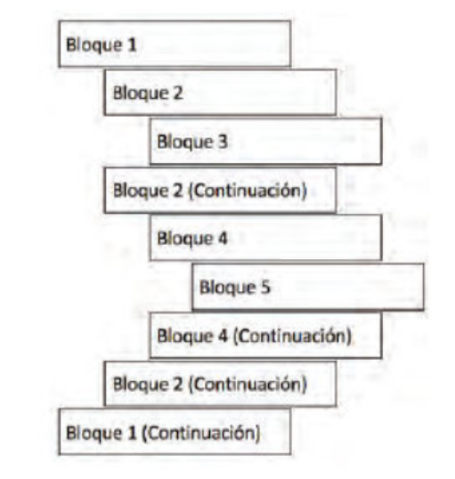

## **Operadores Relacionales**

Los operadores relacionales son operadores que permiten comparar dos elementos, en caso de que la comparacion sea cierta la operacion devolvera True, en caso contrario es False.

- **Menor que:**
  - El operador "<" se utiliza para comprobar si el primer elemento es menor que el segundo.
  
- **Mayor que:**
  - El operador ">" se utiliza para comprobar si el primer elemento es mayor que el segundo elemento.
  
- **Menor o igual que**
  - El operador "<=" se utiliza para comprobar si el primer elemento es menor o igual que el segundo.

- **Mayor o igual que**
  - El operador ">=" se utiliza para comprobar si el primer elemento y el segundo son iguales.

- **Igual Que**
  - El operador "==" se utiliza para comprobar si el primer elemento y el segundo son iguales.

- **Distinto Que**
  - El operador "!=" se utiliza para comprobar si el primer elemento y el segundo son distintos.

## **Bloques e Identacion**

Antes de entrar en detalle de estructuras para el control de flujo de los programas es necesario que entiendas dos conceptos utilizados en desarrollo de software: bloque de identacion

La identacion o tabulacion es una forma de incrementar la legibilidad del codigo fuente mediante el desplazamiento de las sentencias hacia la derecha insertando espacios en blanco o tabuladores, separandolo del margen izquierdo.

La imagen muestra un total de cinco bloques con diferentes identaciones.

