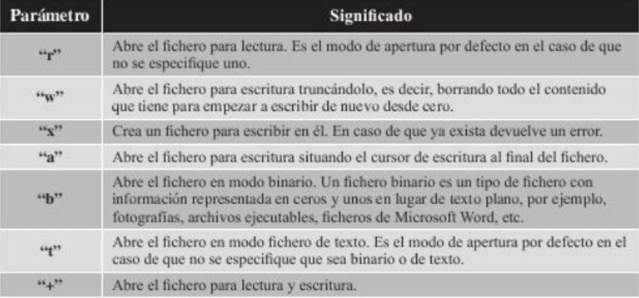

## Manejo de Ficheros

El proceso de manipulacion de ficheros en Python sigue los pasos:
- 1. Apertura del fichero a manipular
- 2. Manipulacion del fichero (lectura/escritura)
- 3. Cierre de fichero

### Apertura y cierre de ficheros

En python para manipular ficheros es necesario antes abrirlos, para ello
Python proporciona una funcion llamada **open** que devuelva un objeto que te
permitira realizar operaciones con el fichero que has abierto.

Una vez ha abierto el fichero es cuando puedes realiar una serie de 
operaciones de manipulacion del contenido del mismo.Una vez has acabado de trabajar
con el fichero de texto necesario que cierrer el fichero.

### Manipulacion:Lectura
La lectura de los ficheros es una operacion que utilizaras muy amenudo.En
el apartado vamos a presentar las diferentes sentencias y formas que puedes utilizar para realizar la opreacion

### Manipulacion:Escritura
Al igual que la lectura de ficheros, la escritura de ficheros es una operacion
que veas utilizar en multitud de ocassiones en desarrollo de software.

## Resumen de funciones de ficheros

El manejo de ficheros en Python incluye una serie de funciones utiles que te
van a permitir utilizar ficheros de una forma mas facil y sencilla. Algunos de ellos 
ya los hemos explicado y utilizado en el capitulo.

- **open:**
  - lo hemos visto en el primer apartado del capitulo, se
    utiliza para abir un fichero
- **close:**
  - lo hemos visto en el primer apartado del capitulo, se utiliza para
    cerrar un fichero.
- **writable:**
  - Funcion que comprueba si el fichero ha sido abierto en modo escritura.
- **readble:**
  - Funcion que comprueba si el fichero ha sido abierto en modo lectura.
- **seekable:**
  - funcion qeu comprueba si el fichero ha sido abierto en modo lectura.
- **read:**
  - lo hemos visto en el segundo apartado del capitulo, se utiliza
- **readline:**
  - lo usamos para leer line por linea
- **readlines:**
  - lo hemos visto para ller varias lineas
- **write:**
  - para escrinir el archivo
- **tell:**
  - devulce la posicion en la se encuentra el cursor
- **seek:**
  - funcion qeu mueve el punteroi ala posicion indicada por parametro.