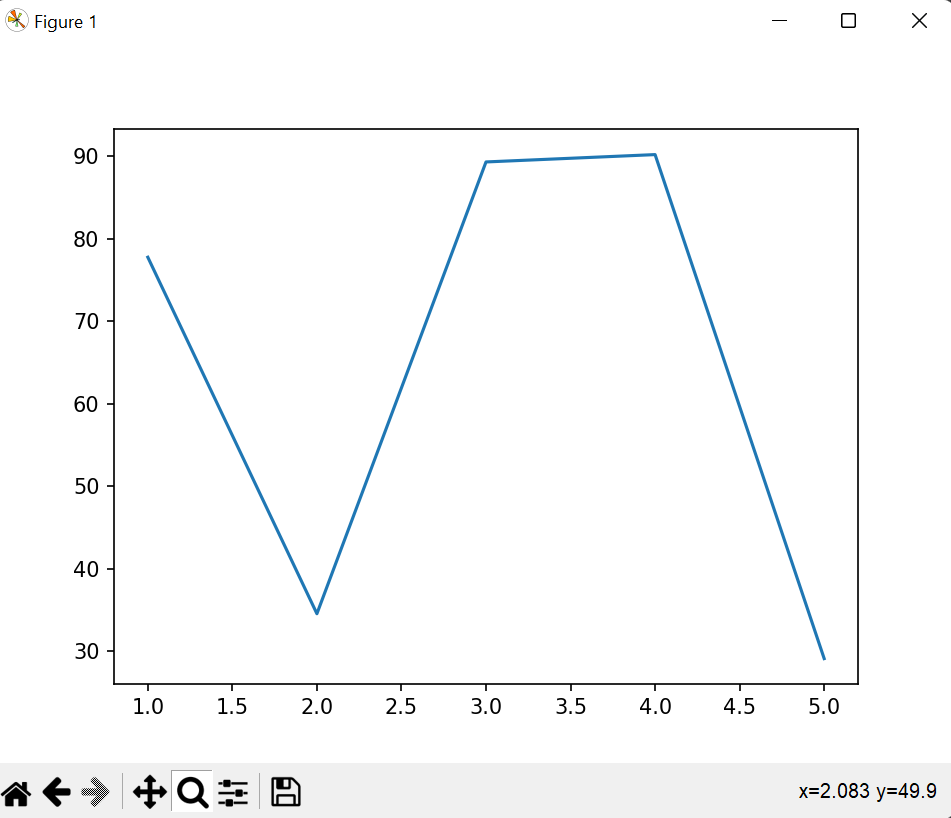
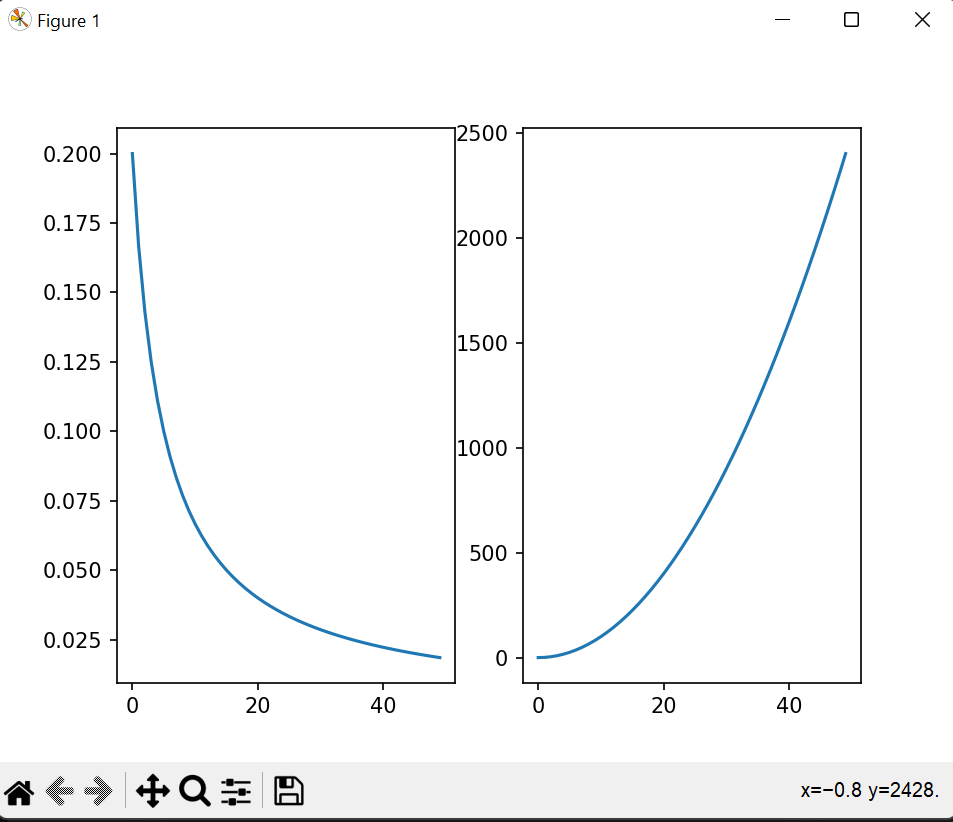
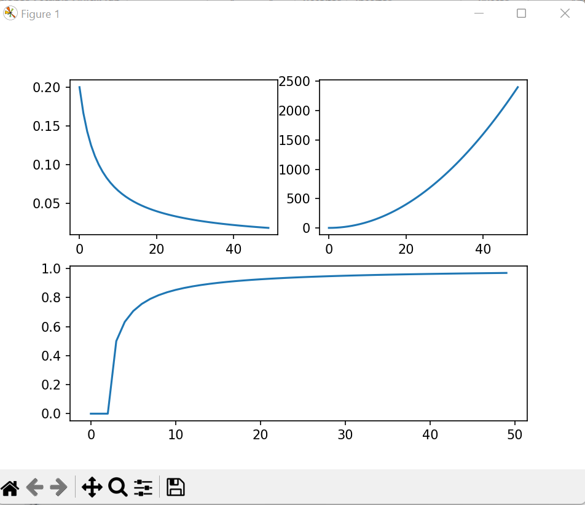
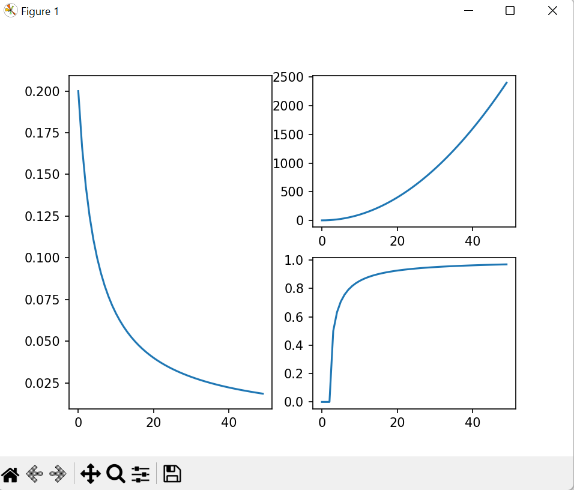

## **Generacion de graficos en Python Mediante Matplotlib(I)**

En Python, de cara a crear graficos de distintos tipos, tenemos multitud de alternativas, cada una con sus particularidades, virtudes y defectos.

El standar de facto para generar graficos 2D (tambien tiene una capacidad mas que aceptable para representar graficos en 3D)

Matplotlib, uno de los programas historicos dentro del ecosistema Python y usado ampliamente por su comunidad de usuarios, especialmente en el entorno cientifico debido ala capacidad para crear graficos de gran calidad.

### **Uso de Matplotlib**

En la instalacion de matplotlib una de sus dependencias es NumPy (en nuestro caso concreto la version 1.9.2).NumPy es una libreria especializada en el procesamiento de lo qeu se denominan arrays multidimensionales.

Mediante el modulo **pylab**, que fusiona matplotlib, un modulo llamado mlab y parte de NumPy para generar un entorno lo mas similar posible a MATLAB, con comandos fusionados y funciones.

Usando un modulo llamado **pyplot**, que usa funciones y comandos similares a los usandos en MATLAB para generar graficos.

Usando los **objetos** propios de la libreria matplotlib : es una manera un poco mas compleja, ya que debemos crear y hacer referencia a los objetos que componen la libreria, trabajando con la filosofia de la programacion orientada objetos.

### **Ejemplo1**

(1,77.77) -> (2,34.56) -> (3,89.32) -> (4,90.21) -> (5,29.12)

### **Ejemplo2**

### **Ejemplo3**

### **Ejemplo4**

