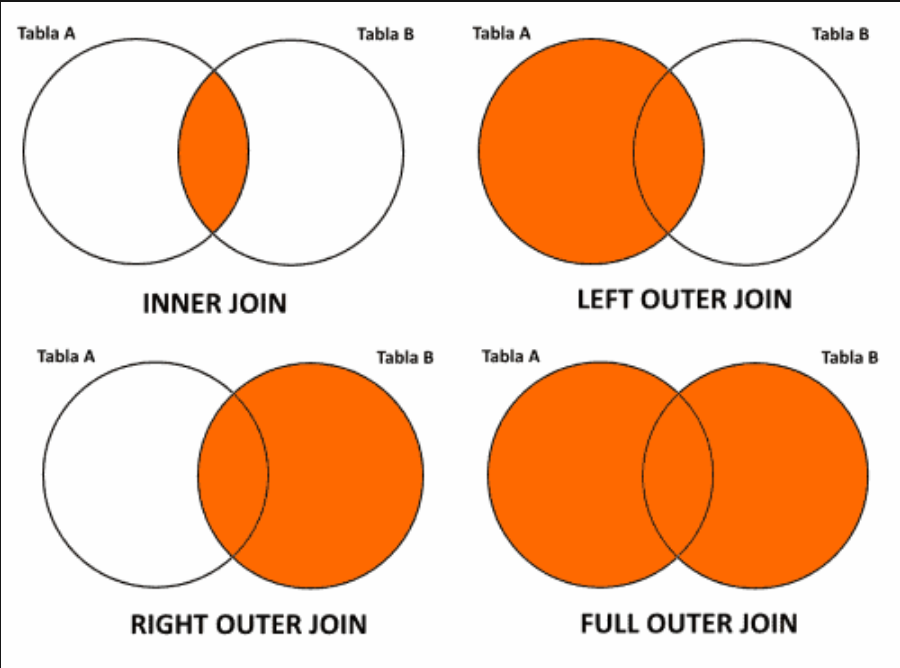

## Combinar conjuntos de datos

``` 
import numpy as np
import pandas as pd
```


### pd.merge()

``` 
clima_p = pd.read_csv(r'C:\Users\ldavidr\Desktop\ny_precipitaciones.csv')
clima_p.shape
```

``` 
clima_p.head()
```

```
clima_t = pd.read_csv(r'C:\Users\ldavidr\Desktop\ny_temperaturas.csv')
clima_t.shape 
```

```
clima_p.NAME 
```

```
 clima_p[clima_p["NAME"] == "ITHACA CORNELL UNIVERSITY, NY US"] 
```

```
precip_itaca = clima_p[clima_p["NAME"] == "ITHACA CORNELL UNIVERSITY, NY US"]
precip_itaca.shape 
```

De forma prederterminada **pd.merge** realiza un Inner Join antre ambos DataFrames

``` 
itaca_inner_merge = pd.merge(precip_itaca, clima_t)
itaca_inner_merge.shape
```

```
itaca_inner_merge.head() 
```

Podemos especificar a **pd.merge** qeu clase de *Join* deseamos hacer entre los DataFrames

```
 itaca_outer_merge = pd.merge(precip_itaca, clima_t, how="outer", on=["STATION", "DATE"])
itaca_outer_merge.columns
```

``` 
itaca_outer_merge.shape
```

```
itaca_outer_merge.head(30) 
```

```
# Left Join

itaca_left_merge = pd.merge(clima_t, precip_itaca,
                        how="left", on=["STATION", "DATE"])
itaca_left_merge.shape
```

```
# Right Join

itaca_right_merge = pd.merge(clima_t, precip_itaca,
                        how="right", on=["STATION", "DATE"])
itaca_right_merge.shape 
```

### .join()

Este es un metodo contenido en el clase **DataFrame**

Se diferencia de **pd.merge()** en que aquel es una funcion del modulos pandas y que **.join()** de forma prederterminada) buscar unir los conjuntos a partir de los indices.

``` 
clima_t.join(clima_p)
```

```
clima_join = clima_t.join(clima_p, lsuffix='_left')
clima_join 
```

```
clima_p.set_index(["STATION", "DATE"]) 
```

```
clima_joined_total = clima_t.join(clima_p.set_index(["STATION", "DATE"]),
                                lsuffix="_x",
                                rsuffix="_y",
                                on=["STATION", "DATE"],
                                )
clima_joined_total.head() 
```

### pd.concat()

En fucion nos permite juntar DataFrames a travaes de un eje, o las filas o las columnas

``` 
clima_total_outer_concat = pd.concat([clima_t, clima_p], axis=1)
clima_total_outer_concat.tail()
```

```
clima_total_outer_concat = pd.concat([clima_t, clima_p], axis=0)
clima_total_outer_concat.shape 
```

```
df_jerar = pd.concat([clima_t, clima_p], keys=["temp", "precip"])
df_jerar 
```