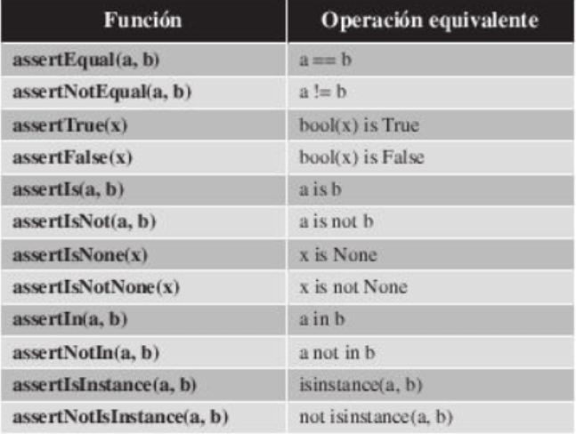

## Pruebas Unitarias

En este capitulo vamos a explicarte que son las pruebas unitarias que 
importancia tiene dentro del desarrollo de software, que beneficios tiene su utilizacion
y por ultimo vamos a realiar un ejercicio.

Una de las cosas mas importantes que existen en el desarrollo de software es 
probar el codigo fuente que se escribe.
Probar el codigo no se significa ejecutar la aplicacion y 
probar empiricamente que funciona y que hace lo que deberia hacer,
probar el software significa escribir pruebas en el codigo fuente.

### *Que son los tests Unitarios*
Las pruebas unitarias son una herramienta de programcion utiliada para 
garantizar que le codigo fuente que se ha desarrollado y que se prueba con la prueba
hace lo que deberia. Las pruebas unitarias son una herramienta de caracter general en 
programacion, lo que significa que no estan ligados a un lenguaje de programacion.

Las pruebas unitarias son la clave para poder garantizar la calidad de cualquier codigo
por tanto al escribir se automatiza el control de calidad del codigo fuente.

La pregunta clave en todo esto ¿Cuando se escriben las pruebas unitarias?
La repuesta es sencilla, a la par que el codigo fuente.Es aconsejanble que escribas pruebas
unitarias para cada funcion, metodo o modulo que se desarrolla de tal forma
que se asegura el correcto funcionamiento.

#### ¿Por que debemos de utilizar pruebas unitarias?

- **Mejoran la calidad:**
  - garantiza que el codigo fuente funcione correctamente.

- **Mejoran los tiempos de desarollo**
  - mediante las pruebas unitarias podremos garantizar que una vez se introduzca modificaciones
  en el codigo fuente esten funcionando.

- **Documentacion**
  - Las pruebas unitarias son la documentacion del codigo
    fuente ya que se describen las funcionalidades del mismo.Si se modifican funcionalidades del software se tendra que 
    actualiar.

### La Realidad 

Utilizar pruebas unitarias tiene mucho beneficio que veremos mas
adelante pero aunque no te lo creas, no son un herramienta que tenga un uso
extendido dentro de la comunidad de desarrollo de software.

## Caracteristicas de una buena prueba unitaria

Llegados a este punto tenemos que hablar sobre que caracterisitcas debe
de tener una prueba unitaria para considerar que es una buena prueba unitria

- Tiene que poder ejecutarse de forma automatica para poder automatizarla.
- Tiene que poder repetirse tantas veces como se quiere.
- Tiene que dejar el entorno o equipo en el que se ejecutan en el mismo estado
- en el que se lo han encontrado al comenzar su ejecucion.
- Tiene que se totalmente independientes con el resto de pruebas, es
  decir no puede afectar a otras pruebas ni verse afectada por otras.

## Beneficios de las pruenas unitarias

El uso de pruebas unitarias en nuestros desarrolladore nos aportan una serie
de beneficios que son los siguientes:

- Acelerar el deasarrollo de software ya que facilitan los cambios en la aplicacio,
- Los tiempos de depuracion y correcion de incidencias se ven reducidas al tener
  preparados pruebas para cada funcion, metodo o modulo los
  errores estan acotados.
- Permiten aprobaciones funciones modulo y metodos sin tenerlo el programa
  desarrollo.
- Las pruebas documentacion el codigo, son un lobro abierto sobre
  el funcionamiento de la funcion y los resultados esperados.
- ayuda a tener un codigo destacado gracias a que cada hora una de muestras
  funciones estan pensada para devolver un resultado.

### Pruebas unitrias en Python

En el capitulo en el que te explicamos la libreria estandar de python te 
dijimos que dicha libreria contiene una libreria para realizar pruebas unitarias
la libreria se llama *unitest* y es la que vamos a utilizar.

### *Codigos de las pruebas*

